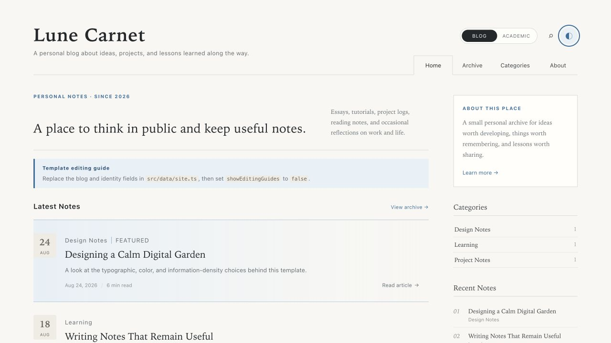
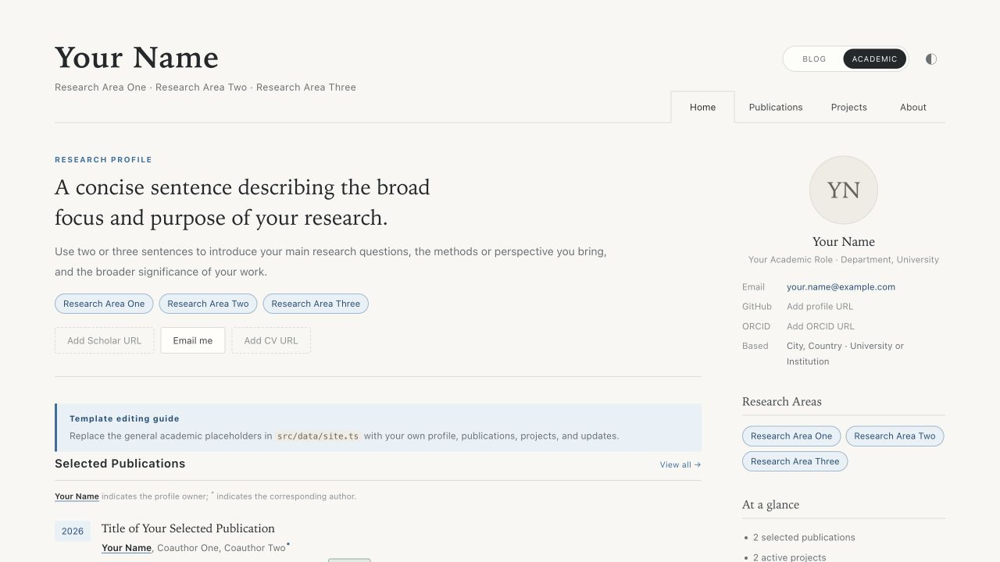

# Lunecarnet

**English** | [简体中文](./README.zh-CN.md)

An Astro template that combines a personal blog and an academic homepage in one repository. Its visual language blends an editorial blog with a restrained academic profile: warm paper tones, serif headings, fine rules, a low-saturation blue accent, and a comfortable reading density.

The template contains no personal information or branding from the reference projects. Its academic sections use discipline-neutral placeholders, and the built-in editing guides explain where to replace them. The repository is ready to use as a GitHub Template Repository.

## Preview

The screenshots show the light theme with the optional editing guides enabled.

### Blog home



### Academic home



## Highlights

- Two complete, responsive site variants built from one shared design system
- Markdown notes with article metadata, table of contents, tags, and adjacent navigation
- Automatic archive and category pages
- Private, browser-local full-text search with no external service
- RSS, Sitemap, robots discovery, canonical URLs, and article metadata
- Light and dark themes with persistent preference and correct browser theme color
- Keyboard navigation, visible focus, reduced-motion support, semantic landmarks, and mobile touch targets
- Optional manual GitHub Pages deployment, pull-request quality checks, and route-level tests
- No analytics, remote font requests, database, or client framework runtime

## Included Pages

- `/blog/` — Blog home with an introduction, Markdown note list, categories, and recent notes.
- `/blog/archive/` — A year-based archive generated automatically from your notes.
- `/blog/categories/` — Category groups generated from Markdown frontmatter.
- `/blog/search/` — Local full-text search across every published note.
- `/blog/about/` — An introduction to the blog and its author.
- `/academic/` — Academic home with research summary, selected work, projects, and news.
- `/academic/publications/` — A complete list of publications and research outputs.
- `/academic/projects/` — Research, open-source, and collaborative projects.
- `/academic/about/` — Biography, education, honors, academic service, and contact details.
- `/` — Displays the variant selected by `defaultVariant` in `src/data/site.ts`.

For a single-purpose site, set `showVariantSwitcher` to `false` to hide the Blog / Academic switcher in the header. The two standalone routes remain available for reference; delete the route files you do not need if you want to remove one variant completely.

## Getting Started

Node.js 22 or later is required.

```bash
npm ci
npm run dev
```

Build the static site with:

```bash
npm run build
```

The generated files are written to `dist/`.

Run the full quality suite with:

```bash
npm test
```

This checks Astro types, creates the static build, and verifies the primary routes, search page, article reading aids, RSS, Sitemap, and robots output.

## Five-Minute Setup

1. Create a repository from this template and clone it.
2. Replace the identity, blog, and academic examples in `src/data/site.ts`.
3. Replace the example notes in `src/content/posts/`.
4. Add publication, project, profile, and CV URLs where available.
5. Set `showEditingGuides` to `false`.
6. Choose `defaultVariant` and decide whether to keep `showVariantSwitcher` enabled.
7. If you use a custom domain or subpath, configure `SITE_URL` and `SITE_BASE` as described below.
8. Run `npm test`, then push to GitHub.

## Customization

Most changes happen in two places:

1. `src/data/site.ts`
   - `defaultVariant` selects the home page shown at the root URL.
   - `showVariantSwitcher` controls the header variant switcher.
   - `showEditingGuides` shows or hides contextual customization notes.
   - `identity` contains your name, email, GitHub profile, and institution.
   - `blog` contains the blog title, home-page copy, About-page sections, contact note, and navigation.
   - `academic` contains your biography, research areas, and academic links.
   - `publications`, `projects`, and `news` power the academic work sections.
   - `education`, `honors`, and `service` power the academic About page.
2. `src/content/posts/`
   - Remove the three example notes and create Markdown files with the same frontmatter structure.

Example note:

```md
---
title: "Your Note Title"
description: "A short summary used on listing pages"
publishDate: 2026-08-27
category: "Category Name"
tags: ["Astro", "Writing"]
draft: false
featured: false
readingTime: 5
---

Start the article here. Section headings should normally begin at `##`.
```

Publication authors use structured records so the template can mark roles consistently:

```ts
authors: [
  { name: "Your Name", self: true },
  { name: "Coauthor One" },
  { name: "Coauthor Two", corresponding: true }
]
```

`self: true` underlines the profile owner's name. `corresponding: true` appends `*` to a corresponding author. Both flags can be used on the same person.

Colors, typography, spacing, and responsive rules are centralized in `src/styles/global.css`. The template uses system fonts, makes no third-party font requests, and has no required image assets. The rationale behind the design system is documented in [`DESIGN.md`](./DESIGN.md).

Editing prompts are separate from the general placeholder content. Keep `showEditingGuides` enabled while customizing, then disable it before publication. Empty publication and project URLs never produce broken `#` links.

The blog follows a common open-source-template pattern: readable demo copy is stored in configuration, while customization instructions live in the optional editing guides. If you remove all example notes, the home page, archive, and category page show purposeful empty states instead of blank sections.

## Content Discovery

- `/rss.xml` contains every published note.
- `/sitemap.xml` includes both site variants and all note routes.
- `/robots.txt` points crawlers to the generated Sitemap.
- The search page embeds a small static index and searches entirely in the browser.
- Canonical and Open Graph metadata are generated by the shared layout; article pages also expose their publication date.

The template intentionally omits a generic social-preview image. Add a site-specific `public/og.png` only after replacing the demo identity and copy, then reference it from `src/layouts/BaseLayout.astro`.

## GitHub Pages

The repository includes `.github/workflows/pages.yml`, but deployment is manual by default so a newly created template repository does not publish example content automatically. To deploy, choose **GitHub Actions** under **Settings → Pages → Build and deployment**, then open **Actions → Deploy to GitHub Pages → Run workflow**.

If you later want every change on `main` to publish automatically, add a `push` trigger for the `main` branch to that workflow. The separate quality workflow continues to test pushes and pull requests without publishing the site.

The workflow automatically derives the correct public origin and path for both common URL formats:

- User site: `username.github.io`
- Project site: `username.github.io/repository-name`

No URL configuration is required for those standard GitHub Pages addresses. For a custom domain, add these repository variables under **Settings → Secrets and variables → Actions → Variables**:

- `SITE_URL`: the public origin, such as `https://www.example.com`
- `SITE_BASE`: `/` for a root-level custom domain, or a path such as `/notes` when the site is served below a subpath

The workflow passes both variables to Astro. This keeps navigation, canonical URLs, RSS, Sitemap, and robots metadata aligned with the deployed address.

## Project Structure

```text
src/components/       Shared components and both home-page variants
src/content/posts/    Markdown blog notes
src/data/site.ts      Site content and variant configuration
src/layouts/          HTML shell, SEO metadata, and page frames
src/pages/            Root route, two site variants, article pages, and 404
src/styles/           Shared design system and responsive styles
.github/workflows/    Quality checks and optional GitHub Pages deployment
tests/                Static-build route and metadata checks
```

## Contributing

Read [`CONTRIBUTING.md`](./CONTRIBUTING.md) before proposing changes. Pull requests run the same `npm test` suite used locally. Issue forms and a pull-request template are included under `.github/`.

## License

[MIT](./LICENSE)
