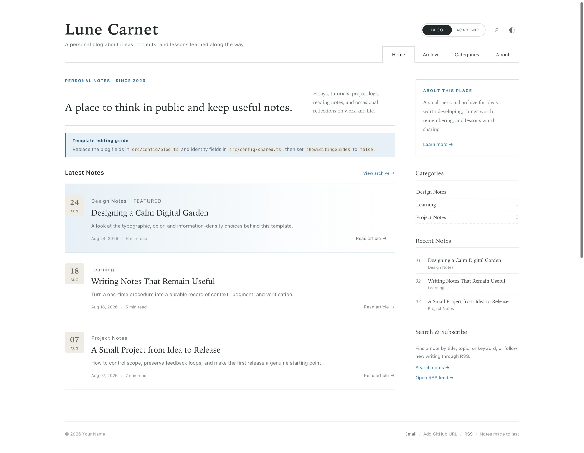
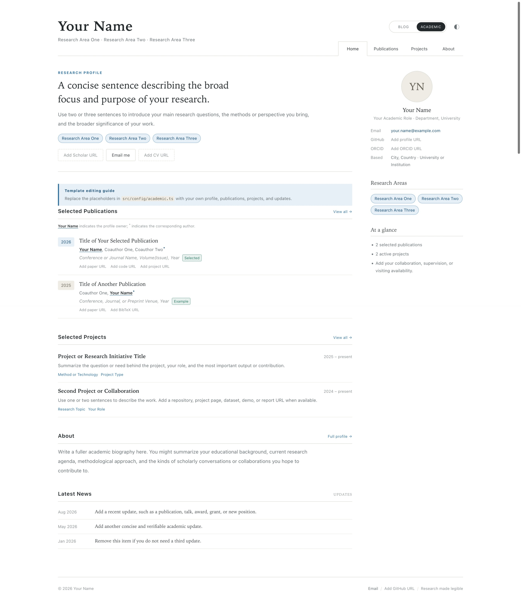

# Lunecarnet

[English](./README.md) | **简体中文**

Lunecarnet 是一套在同一仓库中提供个人博客与学术主页的 Astro 静态模板。它将编辑式博客与克制的学术档案页统一在一套设计语言下：暖色纸张背景、衬线标题、细分隔线、低饱和蓝色，以及适合长时间阅读的信息密度。

模板不包含参考项目中的个人信息或品牌内容。学术部分采用学科中立的通用占位信息，并通过可开关的编辑指引说明应该在哪里替换内容，可直接作为 GitHub Template Repository 使用。

## 页面预览

以下截图使用浅色主题，并保留了可选的模板编辑指引。

### 博客主页



### 学术主页



## 主要特性

- 博客、学术和组合预览三种运行模式，共用一套依赖与设计基础
- 单模板模式使用干净的根级路由，组合模式自动启用命名空间
- 响应式桌面、平板和移动端布局
- Markdown 文章、正文目录、标签及上一篇/下一篇
- 自动生成的文章归档和分类页面
- 完全在浏览器本地运行的全文搜索
- RSS、Sitemap、robots、canonical 与文章元数据
- 持久化明暗主题与浏览器主题色同步
- 键盘导航、可见焦点、减少动态效果和移动端触控尺寸支持
- 可选的 GitHub Pages 手动部署、Pull Request 质量检查和路由测试
- 不包含分析追踪、远程字体、数据库或前端框架运行时

## 三种使用方式

- `blog`：博客主页位于 `/`，归档、分类、搜索、文章和 RSS 都使用根级路由；不会构建学术页面。
- `academic`：学术主页位于 `/`，Publications、Projects 和 About 使用根级路由；不会构建博客页面或 RSS。
- `both`：`/` 是模板选择页，完整模板分别位于 `/blog/` 和 `/academic/`；文章与 RSS 也收纳在 `/blog/` 下。

模板组件只有一份。首页、归档、分类、搜索、About、论文和项目等完整页面视图都由公开组件提供；`sites/blog/`、`sites/academic/` 和实际个人站只保留很薄的路由入口，因此修复页面结构或样式时不需要维护两份实现。

除了复制模板，仓库现在也提供 `@lunecarnet/astro` 包入口。独立个人站可以直接依赖 GitHub version tag，让组件和基础样式随上游版本升级，同时把个人配置、Markdown 和少量样式覆盖留在自己的仓库。完整说明参见 [`docs/DEPENDENCY_USAGE.zh-CN.md`](./docs/DEPENDENCY_USAGE.zh-CN.md)。

## 开始使用

需要 Node.js 22 或更高版本。

```bash
npm ci
npm run dev:blog      # 只使用博客模板
npm run dev:academic  # 只使用学术模板
npm run dev:both      # 同时预览两套模板（npm run dev 的默认模式）
```

生成静态构建：

```bash
npm run build:blog
npm run build:academic
npm run build:both    # npm run build 的默认模式
```

构建结果位于 `dist/`。

运行完整质量检查：

```bash
npm test
```

该命令会依次检查并构建三种模式，验证各自的路由隔离、搜索页、文章阅读组件、RSS、Sitemap 与 robots 输出。

## 快速配置

1. 使用此模板创建仓库并克隆到本地。
2. 在 `src/config/shared.ts` 修改身份和编辑指引设置。
3. 按需要修改 `src/config/blog.ts`、`src/config/academic.ts` 中的模板内容。
4. 使用博客模板时，删除 `src/content/posts/` 中的示例文章并添加自己的 Markdown。
5. 填写论文、项目、GitHub、Scholar、ORCID 和 CV 链接。
6. 完成内容替换后，将 `showEditingGuides` 设置为 `false`。
7. 选择对应的 `dev:*` 和 `build:*` 命令；部署时配置 `SITE_MODE`。
8. 如果使用自定义域名或子路径，按下文说明配置 `SITE_URL` 与 `SITE_BASE`。
9. 执行 `npm test` 后推送到 GitHub。

## 内容配置

配置按职责拆分：

- `src/config/shared.ts`：身份信息和编辑指引开关。
- `src/config/blog.ts`：博客标题、文案与导航。
- `src/config/academic.ts`：学术简介、论文、项目、动态、教育、荣誉与服务。
- `src/config/site.ts`：把个人数据组合成传给可复用组件的类型安全配置。
- `src/config/runtime.ts`：三种构建模式的路径解析；通常不需要修改。

将 `blog.language` 或 `academic.language` 设为 `zh-CN` 会启用内置中文界面。也可以在模板配置的 `messages` 字段中按键覆盖少量文案，而无需复制组件。

原来的 `src/data/site.ts` 保留为兼容导出，已有定制代码不会立刻失效；新代码应使用上述聚焦配置文件。

`academic.longBio` 可以是单个字符串，也可以是字符串数组；数组中的每一项会渲染为独立段落。Academic 首页的 Publications、Projects、About 和 News 可以通过同一文件中的 `academicHomeSections` 分别开关。即使开关开启，没有实际数据的区块也会自动隐藏。

`academic.topics` 继续用于首页和侧栏的短标签；About 页面的 Research Interests 使用可选的 `academic.researchInterests`，每一项包含 `title` 和 `description`，以带分隔线的标题与说明列表展示。Education、Honors 和 Service 等空区块同样不会渲染。

## 论文作者标注

论文作者采用结构化数据，以便主页与 Publications 页面使用一致的标注规则：

```ts
authors: [
  { name: "Your Name", self: true },
  { name: "Coauthor One" },
  { name: "Coauthor Two", corresponding: true }
]
```

- `self: true`：为主页本人姓名添加下划线。
- `corresponding: true`：在通讯作者姓名后添加 `*`。
- 本人同时为通讯作者时，可以同时设置两个字段。
- 作者顺序应与正式论文保持一致。

未填写 URL 的论文链接只会在编辑指引开启时显示为灰色提示，不会生成 `href="#"` 空链接。

博客部分采用开源模板中常见的“自然示例内容 + 独立编辑指引”方式：页面默认展示完整、可读的通用示例，修改说明由 `showEditingGuides` 控制。删除全部示例文章后，首页、归档和分类页会显示有意义的空状态，不会留下空白区域。

## Markdown 文章

在 `src/content/posts/` 中创建文章：

```md
---
title: "Your Note Title"
description: "A short summary used on listing pages"
publishDate: 2026-08-27
category: "Category Name"
tags: ["Astro", "Writing"]
draft: false
featured: false
readingTime: 5
---

Start the article here. Section headings should normally begin at `##`.
```

归档、分类、全文搜索、RSS、Sitemap 和文章详情页都会根据这些文件自动更新。

## 设计与样式

颜色、字体、正文排版、间距和响应式规则集中在 `src/styles/global.css`。可供下游稳定覆盖的 `--lc-*` 设计变量定义在 `src/styles/tokens.css`；模板内部只使用命名空间变量，已有的短变量名仅作为兼容别名保留。模板使用系统字体，不请求第三方字体，也不依赖必须保留的图片资源。

设计原则和变量说明参见 [`DESIGN.md`](./DESIGN.md)。

## GitHub Pages

仓库包含 `.github/workflows/pages.yml`，但默认仅允许手动触发，避免从模板创建的新仓库自动发布示例内容。如需部署，请先在 GitHub 的 **Settings → Pages → Build and deployment** 中选择 **GitHub Actions**，然后进入 **Actions → Deploy to GitHub Pages → Run workflow**。

如果以后希望 `main` 分支的每次更新都自动发布，可在该工作流中添加针对 `main` 的 `push` 触发器。独立的质量检查工作流仍会检查推送和 Pull Request，但不会发布网站。

工作流会自动推导以下两类 GitHub Pages 地址的公开域名和路径：

- 用户主页仓库：`username.github.io`
- 普通项目仓库：`username.github.io/repository-name`

使用上述标准地址时不需要额外配置。若使用自定义域名，请在 **Settings → Secrets and variables → Actions → Variables** 中添加仓库变量：

- `SITE_URL`：公开访问域名，例如 `https://www.example.com`
- `SITE_BASE`：根域名部署填写 `/`；部署在子路径时填写类似 `/notes` 的路径
- `SITE_MODE`：填写 `blog`、`academic` 或 `both`；未设置时默认构建组合模式

工作流会把这些变量传给 Astro，使构建模式、站内导航、canonical、RSS、Sitemap 和 robots 与实际部署保持一致。

## 项目结构

```text
sites/blog/           博客独立站的根级路由入口
sites/academic/       学术独立站的根级路由入口
scripts/              跨平台的模式运行与测试脚本
src/config/           共享、博客、学术和运行时配置
src/index.ts          Git/npm 依赖的公开组件与工具入口
src/types.ts          使用方配置的公开 TypeScript 类型
src/components/       公共组件与两套模板组件
src/content/posts/    Markdown 博客文章
src/data/site.ts      旧配置入口的兼容导出
src/layouts/          公共 HTML/SEO 与模板页面框架
src/pages/            组合模式路由和可复用页面实现
src/styles/           共享设计系统与响应式样式
tests/                三种模式的构建契约测试
.github/              工作流、Issue 表单和 PR 模板
```

## 参与贡献

提交修改前请阅读 [`CONTRIBUTING.md`](./CONTRIBUTING.md)。Pull Request 会自动执行与本地相同的 `npm test` 质量检查。

## License

[MIT](./LICENSE)
